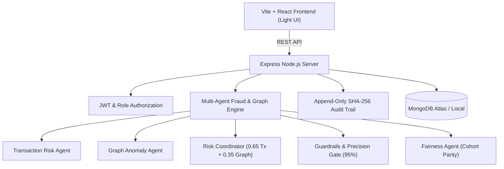

# TRUST GRAPH
> **Multi-Actor Fraud Detection & Graduated Remediation Platform**

[](#) [](LICENSE) [](#) [](#) [](#)

---

## 📌 Demo Credentials

| Role | Email | Password | Access Level |
| :--- | :--- | :--- | :--- |
| **Admin** | `admin@trustgraph.demo` | `Admin@123` | Full System & Configuration Access |
| **Investigator** | `investigator@trustgraph.demo` | `Investigator@123` | Case Review Workbench & Appeals Queue |

---

## 📖 Problem Statement & Multi-Actor Fraud

Traditional fraud engines evaluate transactions in isolation. In e-commerce ecosystems across India (such as Visakhapatnam, Hyderabad, Bengaluru, Mumbai, and Delhi), sophisticated fraud rings operate across multiple actors:

- **Customers** abusing return policies via fake empty parcel claims using multiple accounts on the same mobile device.
- **Sellers** placing self-orders using shared Wi-Fi IP addresses to inflate ratings and claim non-existent sales volume.
- **Delivery Partners** marking parcels as delivered kilometers away from the true destination (GPS mismatch) or substituting goods.
- **Collusion Networks** where customers, sellers, and delivery partners share devices, payment cards, or delivery addresses.

Standard rigid rules often result in blanket account suspensions that destroy honest small seller livelihoods without a fast, transparent appeal mechanism.

---

## 🚀 Proposed Solution: TRUST GRAPH

**TRUST GRAPH** combines deterministic transaction risk scoring with network graph topology analysis, automated 95% precision safety guardrails, livelihood protection, cohort demographic parity monitoring, an append-only SHA-256 tamper-evident audit trail, and a human-in-the-loop appeal workflow.

### Key Features
1. **Multi-Actor Network Graph**: Nodes for Customers, Sellers, Delivery Partners, Transactions, Devices, IPs, and Delivery Addresses.
2. **Deterministic Risk Scoring**: 65% Transaction Risk + 35% Graph Risk clamped between 0 and 100.
3. **Automated 95% Precision Gate**: Automated hard actions (suspensions & payout freezes) are blocked if historical precision drops below 95%.
4. **Livelihood Protection**: All income-affecting actions are temporary (72h limit), appealable, and SLA-bound.
5. **Append-Only SHA-256 Audit Trail**: Hash-chained event logs for cryptographic proof against evidence tampering.
6. **Cohort Demographic Parity**: Monitors action rates across small vs large sellers to prevent bias.
7. **Enterprise Light UI**: Crisp design system built with Tailwind CSS, Recharts, and SVG graph topology visualizers.

---

## 🏗 System Architecture & Workflow



---

## 🤖 Multi-Agent Responsibilities

| Agent Module | Implementation | Primary Responsibilities |
| :--- | :--- | :--- |
| **Transaction Risk Agent** | Algorithmic Rule Engine | Evaluates 12+ signals (+18 refund velocity, +18 chargebacks, +17 rating bursts, +20 GPS deviation, +22 POD mismatch). |
| **Customer Behavior Agent** | Algorithmic Sequence Scorer | Detects rapid return abuse velocity, device re-registration, and suspicious address reuse. |
| **Seller Integrity Agent** | Algorithmic Pattern Scorer | Detects rating burst spikes, self-ordering cycles, shared Wi-Fi IP clusters, and payout anomalies. |
| **Delivery Integrity Agent** | Geo-Spatial Scorer | Detects delivery GPS mismatches (>5km), photo proof discrepancies, and partner complaint clusters. |
| **Graph Anomaly Agent** | Graph Topology Engine | Calculates node degrees, shared identifier frequency (devices, IPs, addresses), and dense connected clusters. |
| **Risk Coordinator** | Weighted Scoring Merging | Merges transaction risk (65%) and graph risk (35%), clamps combined score (0-100), and assigns graduated action. |
| **Fairness Agent** | Statistical Parity Scorer | Computes cohort intervention rates, parity gaps between small vs large sellers, and flags disproportionate impact. |
| **Guardrail & Self-Check Agent** | Safety & SLA Enforcement | Enforces 95% historical precision gate to block automated hard actions and maintains 72h livelihood limits. |

---

## 📐 Scoring Formulas

### 1. Transaction Risk Score
$$\text{TxRisk} = \min\left(100, \sum \text{Triggered Signal Weights}\right)$$

### 2. Graph Topology Risk Score
$$\text{GraphRisk} = \min\left(100, \text{SharedDevices} + \text{SharedIPs} + \text{SharedAddresses} + \text{RepeatedPairs} + \text{ClusterDensity}\right)$$

### 3. Combined Risk Score
$$\text{CombinedRisk} = 0.65 \times \text{TxRisk} + 0.35 \times \text{GraphRisk}$$

---

## 🛡 Risk Levels & Graduated Remediation

| Score Range | Risk Level | Graduated Action | Action Character |
| :--- | :--- | :--- | :--- |
| **0 – 24** | Low | `monitor` | Passive Monitoring |
| **25 – 49** | Medium | `step_up_verification` | Additional Delivery Proof / Review |
| **50 – 74** | High | `temporary_payout_hold` | 72-Hour Payout Hold (Appealable) |
| **75 – 100** | Critical | `payout_freeze` / `suspension` | Temporary Freeze (Requires 95% Precision Gate) |

---

## 🔒 Cryptographic Audit Trail (SHA-256)

Every audit event generates a cryptographic hash using:
$$\text{CurrentHash} = \text{SHA256}\left(\text{eventId} + \text{caseId} + \text{action} + \text{timestamp} + \text{previousHash}\right)$$

The system provides a live `/api/audit/verify` endpoint that validates the entire chain from the genesis block to detect any unauthorized database tampering.

---

## 💻 Local Installation & Setup

### Prerequisites
- Node.js v18+ and npm
- MongoDB running locally (`mongodb://127.0.0.1:27017/trust_graph`) or MongoDB Atlas URI

### 1. Install Monorepo Dependencies
```bash
npm run install:all
```

### 2. Seed Synthetic Indian E-Commerce Data
```bash
npm run seed
```

### 3. Start Backend & Frontend
```bash
# Terminal 1: Backend Server (Port 5000)
npm run dev:server

# Terminal 2: Frontend Client (Port 5173)
npm run dev:client
```

---

## 🧪 Testing Commands

```bash
# Run Backend Logic Tests (Vitest)
npm run test:server

# Run Frontend Build Check
npm run build:client
```

---

## 🚀 GitHub Push & Render Deployment

### GitHub Repository Initialization
```bash
git init
git add .
git commit -m "Build Trust Graph multi-actor fraud detection MVP"
git branch -M main
git remote add origin https://github.com/YOUR_USERNAME/trust-graph.git
git push -u origin main
```

### Render Deployment Configuration (`render.yaml`)
- **Backend Web Service**: Root Directory `server`, Build Command `npm install`, Start Command `npm start`.
- **Frontend Static Site**: Root Directory `client`, Build Command `npm install && npm run build`, Static Publish Path `./dist`, Rewrite `/* -> /index.html`.

---

## 🛡 Security & DPDP Compliance Statement
The platform displays **"India Region (ap-south-1)"**. Legal compliance under the Indian Digital Personal Data Protection (DPDP) Act requires hosting production databases, application logs, and backups within approved Indian data center regions. All data present in this project is 100% synthetic demonstration data.

---

## 📄 License
Licensed under the [MIT License](LICENSE).
