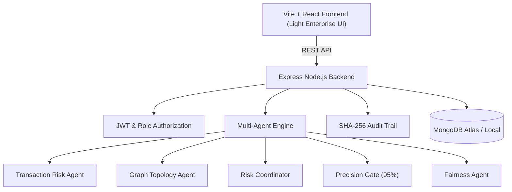

# TRUST GRAPH Architecture Documentation

## System Overview
TRUST GRAPH is a multi-actor fraud detection and graduated remediation platform for e-commerce networks in India.

### Architectural Diagram

### Risk Formulas
1. **Transaction Risk Score**:
   $$\text{TxRisk} = \min\left(100, \sum \text{Triggered Signal Weights}\right)$$
2. **Graph Risk Score**:
   $$\text{GraphRisk} = \min\left(100, \text{SharedDevices} + \text{SharedIPs} + \text{SharedAddresses} + \text{RepeatedPairs} + \text{ClusterDensity}\right)$$
3. **Combined Risk Score**:
   $$\text{CombinedRisk} = 0.65 \times \text{TxRisk} + 0.35 \times \text{GraphRisk}$$

### Precision Guardrail Gate
Automated hard actions (suspensions and payout freezes) require historical measured precision $\ge 95.0\%$. If measured precision falls below $95.0\%$, hard actions are blocked and routed to human investigators.
